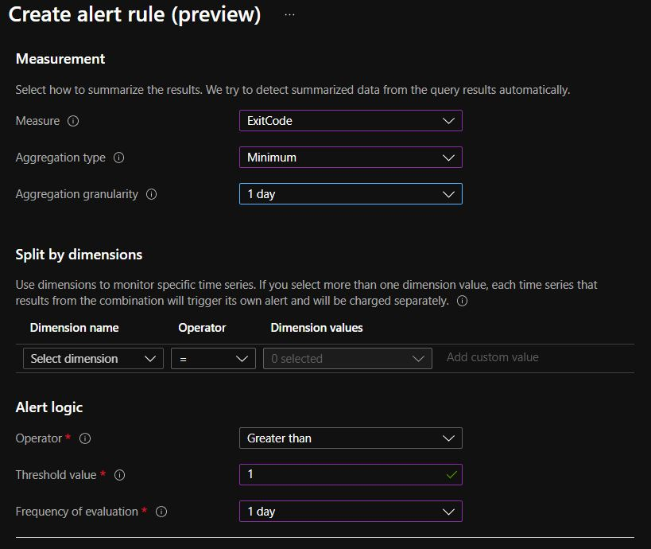
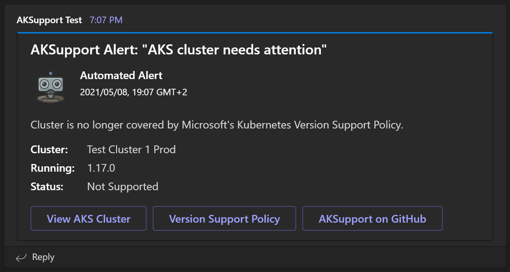
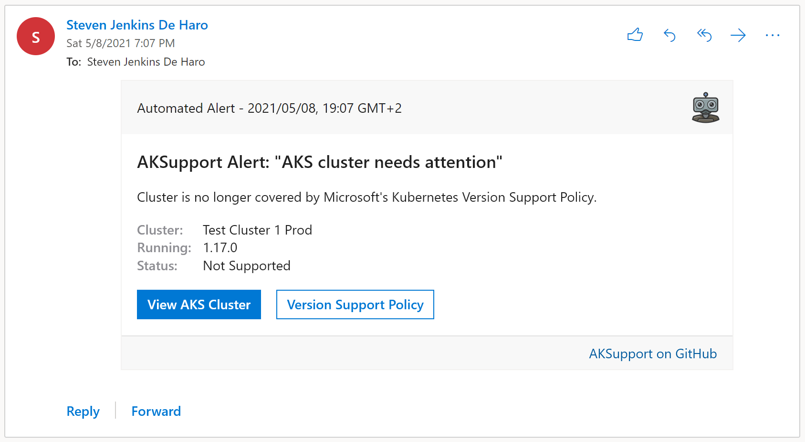

# AKSupport

[](https://github.com/StevenJDH/AKSupport/actions/workflows/dotnet-sonar-container-workflow.yml)

[](https://www.codacy.com/gh/StevenJDH/AKSupport/dashboard?utm_source=github.com&amp;utm_medium=referral&amp;utm_content=StevenJDH/AKSupport&amp;utm_campaign=Badge_Grade)
[](https://sonarcloud.io/dashboard?id=StevenJDH_AKSupport)
[](https://sonarcloud.io/dashboard?id=StevenJDH_AKSupport)
[](https://sonarcloud.io/dashboard?id=StevenJDH_AKSupport)
[](https://sonarcloud.io/dashboard?id=StevenJDH_AKSupport)
[](https://sonarcloud.io/dashboard?id=StevenJDH_AKSupport)
[](https://sonarcloud.io/dashboard?id=StevenJDH_AKSupport)
[](https://sonarcloud.io/dashboard?id=StevenJDH_AKSupport)
[](https://sonarcloud.io/dashboard?id=StevenJDH_AKSupport)


AKSupport is an automation tool that regularly checks for the current supported status of an AKS cluster to alert those interested that an upgrade is needed to maintain Microsoft support. In other words, rather than always manually checking different AKS clusters across multiple environments to keep up with the [Kubernetes version support policy](https://docs.microsoft.com/en-us/azure/aks/supported-kubernetes-versions#kubernetes-version-support-policy), AKSupport will manage all of this for you. This also covers situations where a supported version is pulled early by Microsoft due to security concerns or other critical issues, which they reserve the right to do. In the end, the goal is to free people up for other value-add tasks by keeping things simple for the many uses cases that can benefit from such a tool like general maintenance, Infrastructure as Code (IaC) deployments, etc.

[](https://www.buymeacoffee.com/stevenjdh)

Releases: [https://github.com/StevenJDH/AKSupport/releases](https://github.com/StevenJDH/AKSupport/releases)

## Features
* Out of support and near end of support checking.
* Works with all regions where AKS is available.
* Azure Monitor integration via Container Insights.
* Office Mail integration via Microsoft Graph API.
* Teams integration via a channel's incoming webhook.
* Customizable avatar image for local company branding.

## Prerequisites
* An Azure Kubernetes Service (AKS) cluster.
* [Container Insights](https://docs.microsoft.com/en-us/azure/azure-monitor/containers/container-insights-enable-new-cluster) enabled for Log alert rules only.
* Latest version of [Azure CLI](https://docs.microsoft.com/en-us/cli/azure/install-azure-cli).
* An Azure [Service Principal](https://docs.microsoft.com/en-us/cli/azure/ad/sp?view=azure-cli-latest#az_ad_sp_create_for_rbac) for API access.
* An Office 365 tenant with Service Principal for Mail and Teams features.
* A [supported Office 365 version or Outlook client](https://docs.microsoft.com/en-us/outlook/actionable-messages/#outlook-version-requirements-for-actionable-messages) for actionable message cards.
* [Terraform](https://www.terraform.io/downloads.html) 0.15.x for POC only.

## Usage
The following are the steps needed to set up AKSupport correctly along with the needed API permissions:

1. In a console window, type `az ad sp create-for-rbac -n "AKSupport"` to create a [Service Principal](https://docs.microsoft.com/en-us/cli/azure/ad/sp?view=azure-cli-latest#az_ad_sp_create_for_rbac) in Azure. Currently, this assigns `Contributor` rights to the SP, but in the future, this will change. Use `--skip-assignment` to skip the role assignment if a more specific role is needed, and then follow the [Steps to assign an Azure role](https://docs.microsoft.com/en-us/azure/role-based-access-control/role-assignments-steps) article. The output from the command should look like the following:

   ```json
   {
     "appId": "...",
     "displayName": "AKSupport",
     "name": "http://AKSupport",
     "password": "...",
     "tenant": "..."
   }
   ```

2. Create a Kubernetes Secret in AKS for the SP `password` by typing:

   ```bash
   kubectl create secret generic aksupport-secret --from-literal=AZURE_APP_PASSWORD=<password>
   ```

3. Create a Kubernetes ConfigMap in AKS for the SP appId and tenant fields along with the AKS subscription ID and region by typing:

   ```bash
   kubectl create configmap aksupport-config --from-literal=AZURE_SUBSCRIPTION_ID=<subscriptionId> \
       --from-literal=AZURE_APP_TENANT=<tenant> \
       --from-literal=AZURE_APP_ID=<appId> \
       --from-literal=AZURE_AKS_REGION=<region>
   ```

4. Create a Kubernetes CronJob in AKS for AKSupport by using the following command and provided definition:

   ```bash
   kubectl create -f https://raw.githubusercontent.com/StevenJDH/AKSupport/main/YAML/aksupport-cronjob.yaml
   ```

5. Assuming everything was set up correctly, AKSupport will run at the default configured time via the CronJob at 8:00am every morning. You will also need to [configure at least one](#configuring-notifications) notification method to receive notifications. To confirm the creation of the AKSupport CronJob, type:

   ```bash
   kubectl get cronjobs
   ```

In addition to the imperative commands used to create the Secret and the ConfigMap above, YAML versions have also been provided if a declarative approach is preferred. Just remember to [Base64 encode](https://www.base64encode.net/) any values defined in the Secret when using YAML.

## Configuring notifications
AKSupport currently supports integrating with Azure Monitor, Teams, and Office Mail as inclusive methods for issuing notifications when the support status of a cluster requires attention. The method or methods chosen will depend on preference and any security policies that an individual or organization must follow.

### Azure Monitor integration
This integration is the most flexible because, although it uses Container Insights, it can use any third-party equivalent tool or service to implement any custom logic needed for the notifications, and it is easier to implement in terms of company security policies. To enable the integration support with Azure Monitor, perform the following steps:

1. In the [Azure Portal](https://portal.azure.com), open the AKS cluster resource where AKSupport is installed.
2. Select the `Logs` blade under the `Monitoring` section.
3. Close the query suggestion window that appears, and paste the following Kusto (KQL) query:

   ```kusto
   ContainerInventory
   | where TimeGenerated > ago(1d)
   | where Image == "aksupport" and ExitCode > 0 and ContainerState == "Failed"
   | top 10 by FinishedTime desc
   | project Computer, ContainerHostname, Image, ImageTag, ContainerState, ExitCode, 
   StartedTime, FinishedTime
   ```

4. Click `New alert rule` located at the top of the query window.
5. Configure the rule using following screenshot as an example:

   

6. Click `Next: Actions >` below, and select or create a new action group. If you are creating a new action group, under the `Notifications` tab, select the `Email\SMS message\Push\Voice` option to get the window that will let you use any of these features.
7. Finally, before finishing the rule creation process, make sure to enable `Mute actions` with the desired period of time in the `Advance options` section under the `Details` tab.

Once configured, the alert rule will trigger the logic defined in the action group anytime AKSupport detects a support related issue with the AKS cluster. Similar steps can be applied for other tool like [Grafana's Alert notifications](https://grafana.com/docs/grafana/latest/alerting/notifications/), which provides even more upstream integrations.

### Teams integration 



To enable the integration support with Teams, [add an incoming webhook to a Teams channel](https://docs.microsoft.com/en-us/microsoftteams/platform/webhooks-and-connectors/how-to/add-incoming-webhook#add-an-incoming-webhook-to-a-teams-channel) for where you would like to receive the AKSupport notifications. Name the webhook `AKSupport`, and recreate the Secret created in the [Usage](#usage) section to include the `TEAMS_CHANNEL_WEBHOOK_URL` key with the generated webhook URL as its value. Add `AVATAR_IMAGE_URL`, `AZURE_AKS_CLUSTER_NAME`, and `AZURE_AKS_CLUSTER_URL` as additional keys to the ConfigMap from the same section to define the notification avatar image, cluster name, and Azure Portal URL for the cluster. The following is an example with the additional keys:

**Secret:**

   ```bash
   kubectl create secret generic aksupport-secret --from-literal=AZURE_APP_PASSWORD=<password> \
       --from-literal=TEAMS_CHANNEL_WEBHOOK_URL=<incoming-webhook-url>
   ```

**ConfigMap:**

   ```bash
   kubectl create configmap aksupport-config --from-literal=AZURE_SUBSCRIPTION_ID=<subscriptionId> \
       --from-literal=AZURE_APP_TENANT=<tenant> \
       --from-literal=AZURE_APP_ID=<appId> \
       --from-literal=AZURE_AKS_REGION=<region> \
       --from-literal=AVATAR_IMAGE_URL=https://raw.githubusercontent.com/StevenJDH/AKSupport/main/Avatars/aksupport-256x256-transparent-bg.png \
       --from-literal=AZURE_AKS_CLUSTER_NAME=<cluster-name> \
       --from-literal=AZURE_AKS_CLUSTER_URL=<cluster-url>
   ```

Notifications that arrive to the defined Teams channel will use the Message Card format, since Adaptive Cards are still not supported for incoming webhooks, but the experience is the same. As a reminder, the incoming webhook URL should not be shared outside of its intended use.

### Office Mail integration



To enable the integration with Office Mail, a separate Service Principal needs to be created first for an Office Tenant, not an Azure Tenant. The easiest way to do this is from the [Office 365 Active Directory](https://aad.portal.azure.com) page using the [App registrations](https://aad.portal.azure.com/#blade/Microsoft_AAD_IAM/ActiveDirectoryMenuBlade/RegisteredApps) blade if the tenant is not located in an Azure subscription. Perform the following steps to set up the Service Principal with the correct permissions:

1. Register a new app to create the SP, and call it `AKSupport`.
2. After the app is created, click on it, and under `Certificates & secrets`, generate an new client secret with `rbac` as the description and whatever is needed for the expiration time.
3. Under `API permissions`, click `Add a permission`, and select `Microsoft Graph` followed by `Application permissions`.
4. Search for `Mail.Send`, select it, and click `Add permission`. Admin consent is needed for the permission to take effect.

With the Application (Client) ID and Directory (Tenant) ID from the Overview blade, and the Client Secret (Password) created earlier, AKSupport can now be configured for mail. Recreate the Secret created in the [Usage](#usage) or the [Teams integration](#teams-integration) section to include the `MAIL_APP_PASSWORD` key with the client secret just created as its value. Add `MAIL_APP_TENANT`, `MAIL_APP_ID`, `MAIL_SENDER_ID`, `MAIL_RECIPIENT_ADDRESS`, `AVATAR_IMAGE_URL`, `AZURE_AKS_CLUSTER_NAME`, and`AZURE_AKS_CLUSTER_URL` as additional keys to the ConfigMap from the same section to define the remaining SP details, the sender and recipient email addresses for mail, and the avatar image and cluster details if not already present. The end result without the Teams configuration for brevity should look like the following:

**Secret:**

   ```bash
   kubectl create secret generic aksupport-secret --from-literal=AZURE_APP_PASSWORD=<password> \
       --from-literal=MAIL_APP_PASSWORD=<password>
   ```

**ConfigMap:**

   ```bash
   kubectl create configmap aksupport-config --from-literal=AZURE_SUBSCRIPTION_ID=<subscriptionId> \
       --from-literal=AZURE_APP_TENANT=<tenant> \
       --from-literal=AZURE_APP_ID=<appId> \
       --from-literal=AZURE_AKS_REGION=<region> \
       --from-literal=MAIL_APP_TENANT=<office-tenant> \
       --from-literal=MAIL_APP_ID=<office-appId> \
       --from-literal=MAIL_SENDER_ID=<objectId-or-email-address> \
       --from-literal=MAIL_RECIPIENT_ADDRESS=<email-address> \
       --from-literal=AVATAR_IMAGE_URL=https://raw.githubusercontent.com/StevenJDH/AKSupport/main/Avatars/aksupport-256x256-transparent-bg.png \
       --from-literal=AZURE_AKS_CLUSTER_NAME=<cluster-name> \
       --from-literal=AZURE_AKS_CLUSTER_URL=<cluster-url>
   ```
> 📝**NOTE:** For `MAIL_SENDER_ID`, it is recommended to use the user's `Object ID` for privacy as opposed to their email address. See [Find the user object ID](https://docs.microsoft.com/en-us/partner-center/find-ids-and-domain-names#find-the-user-object-id) for more information.

Notifications that arrive to the defined recipient email address will use the Adaptive Card format for [Actionable Messages](https://docs.microsoft.com/en-us/outlook/actionable-messages/#outlook-version-requirements-for-actionable-messages). Finally, as an additional security step, since this mail workflow uses the `Application permissions` approach instead of the `Delegated permissions` approach, an application security policy should be implemented to restrict access to one user account for sender as opposed to any user account, which is the default. See [Scoping application permissions to specific Exchange Online mailboxes](https://docs.microsoft.com/en-us/graph/auth-limit-mailbox-access) for steps on how to create the needed policy.

## Exit codes
Every time that AKSupport finishes its checks, it will return one of three exit codes. To view the last exit code, type:

```bash
kubectl get pod <aksupport-cronjob-00-00> --output="jsonpath={.status.containerStatuses[].state.terminated.exitCode}"
```

Exit codes can be useful for alert rules configured in Azure or other monitoring tools to perform additional tasks like triggering an action group that can send out an SMS or Email notification, or call an Azure Function that creates a ticket in Jira.

|Exit Code  |Meaning                                                                       
|:---------:|:--------------
|0          |The version of Kubernetes in AKS is still supported.
|1          |The application failed due to an error.
|2          |The version of Kubernetes in AKS is not supported.
|3          |The version of Kubernetes in AKS is about to lose support.

## Testing
To test AKSupport with a specific version to see if it works correctly, edit the [CronJob definition](https://raw.githubusercontent.com/StevenJDH/AKSupport/main/YAML/aksupport-cronjob.yaml) by uncommenting the `args` section like below, and by adding the desired version in quotes.

```yaml
...
containers:
- name: aksupport
  image: public.ecr.aws/stevenjdh/aksupport
  # Uncomment below for testing a specific version.
  args:
  - "1.17.0"
...
```

Also, change the `schedule` field to `* * * * *` to run AKSupport every minute while testing or to any other [cron expression](https://crontab.guru/) as needed. Use `az aks get-versions --location <region> --output table` to see what versions are currently supported for a particular region and their upgrade paths as a reference.

## Additional information
When AKSupport finishes checking the environment, the underlying Pod will either have a `Completed` status or an `Error` status by design. Only the last state will be visible at any given time. To view the logs for the last run of the Pod, type:

```bash
kubectl logs <aksupport-cronjob-00-00>
```

In the logs, there will be additional information for the result of the check or any errors that occurred.

## Terraform
Included is a POC created using Terraform for Infrastructure as Code (IaC) to quickly create a working test environment. The POC includes an AKS instance, Container Insights, an Action Group for email alerts, and all the Kubernetes resources, but the Azure Monitor [Log alert rule](#azure-monitor-integration) will have to be created manually if needed as this is [not yet supported](https://github.com/terraform-providers/terraform-provider-azurerm/issues/4395). To create the POC, perform the following steps:

1. Change to the `Terraform` directory, and initialize the POC:
   
   ```bash
   terraform init
   ```

2. Create a new plan with only Azure Monitor integration:

   ```bash
   terraform plan -var subscription_id=xxx -var app_tenant_id=xxx -var app_id=xxx -var app_password=xxx -var prep_for_azure_monitor_alert=true -var mail_recipient_address=xxx -out aksupport.tfplan
   ```

3. Create the resources based on the plan:

   ```bash
   terraform apply "aksupport.tfplan"
   ```

4. Explore the POC, and when done, delete it using the same variables as before:

   ```bash
   terraform destroy -var subscription_id=xxx -var app_tenant_id=xxx -var app_id=xxx -var app_password=xxx -var prep_for_azure_monitor_alert=true -var mail_recipient_address=xxx
   ```

The `prep_for_azure_monitor_alert` variable controls whether extra resources are created for the Azure Monitor integration like Container Insights. If they are not, then set that variable to `false` and remove the `mail_recipient_address` variable unless the Office Mail configuration is being used. The `variables.tf` file contains all variables needed for additional configurations. For testing with specific version like in the [Testing](#testing) section, add `-var version_test=[\"1.17.0\"]` with escaped quotes if using Windows, or `-var version_test=["1.17.0"]` if not, to the `terraform plan` and `terraform destroy` steps.

## Container registries
AKSupport container images are currently hosted on the following platforms:

* [Amazon Elastic Container Registry (ECR)](https://gallery.ecr.aws/stevenjdh/aksupport)
* [GitHub Container Registry](https://github.com/users/StevenJDH/packages/container/package/aksupport)
* [Docker Hub](https://hub.docker.com/repository/docker/stevenjdh/aksupport)

For production use cases, it is not recommended to pull an image with the `:latest` tag, or no tag since these are equivalent. And yes, it is ironic storing an image meant for Azure on AWS, but they offer free storage.😏

## Disclaimer
AKSupport is distributed in the hope that it will be useful, but WITHOUT ANY WARRANTY; without even the implied warranty of MERCHANTABILITY or FITNESS FOR A PARTICULAR PURPOSE. See the GNU General Public License for more details.

## Contributing
Thanks for your interest in contributing! There are many ways to contribute to this project. Get started [here](https://github.com/StevenJDH/.github/blob/main/docs/CONTRIBUTING.md).

## Do you have any questions?
Many commonly asked questions are answered in the FAQ:
[https://github.com/StevenJDH/AKSupport/wiki/FAQ](https://github.com/StevenJDH/AKSupport/wiki/FAQ)

## Need to contact me?
Feel free to contact me with any questions you may have, and I'll make sure to answer them as soon as possible!

| Platform  | Link        |
|:----------|:------------|
| 💬 Instant Message Chat (preferred) | [](https://discord.gg/VzzzjetTkT)

## Want to show your support?

|Method       | Address                                                                                                    |
|------------:|:-----------------------------------------------------------------------------------------------------------|
|PayPal:      | [https://www.paypal.me/stevenjdh](https://www.paypal.me/stevenjdh "Steven's Paypal Page")                  |
|Bitcoin:     | 3GyeQvN6imXEHVcdwrZwKHLZNGdnXeDfw2                                                                         |
|Litecoin:    | MAJtR4ccdyUQtiiBpg9PwF2AZ6Xbk5ioLm                                                                         |
|Ethereum:    | 0xa62b53c1d49f9C481e20E5675fbffDab2Fcda82E                                                                 |
|Dash:        | Xw5bDL93fFNHe9FAGHV4hjoGfDpfwsqAAj                                                                         |
|Zcash:       | t1a2Kr3jFv8WksgPBcMZFwiYM8Hn5QCMAs5                                                                        |
|PIVX:        | DQq2qeny1TveZDcZFWwQVGdKchFGtzeieU                                                                         |
|Ripple:      | rLHzPsX6oXkzU2qL12kHCH8G8cnZv1rBJh<br />Destination Tag: 2357564055                                        |
|Monero:      | 4GdoN7NCTi8a5gZug7PrwZNKjvHFmKeV11L6pNJPgj5QNEHsN6eeX3D<br />&#8618;aAQFwZ1ufD4LYCZKArktt113W7QjWvQ7CWDXrwM8yCGgEdhV3Wt|


// Steven Jenkins De Haro ("StevenJDH" on GitHub)
